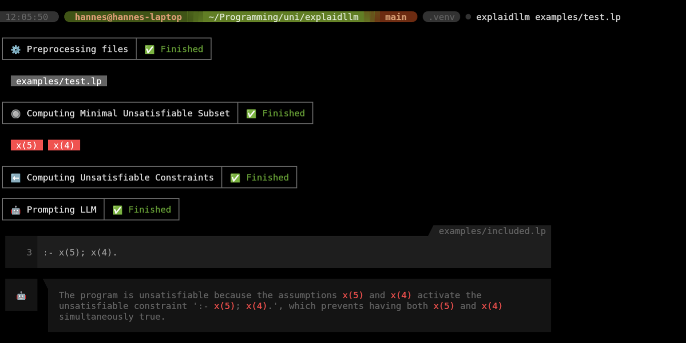

# ExplaidLLM

ExplaidLLM is a command line tool aimed for debugging clingo programs. This is achieved by combining the Minimal
Unsatisfiable Subset (MUS) functionalities of `clingexplaid` together with the natural language capabilities of an LLM.



## Installation

### From Source

`pip install .`

### From PyPi

`coming soon`

## Configuration

### LLM API

Before using ExplaidLLM you need to store your API Key to prompt your LLM of choice (Currently only OpenAI).
You can do this in two different ways:

#### Using a `.env` file

+ Recommended for installation from source

```.dotenv
OPENAI_API_KEY=<YOUR-KEY-GOES-HERE>
```

#### Using the `-k` API-KEY option

+ Recommended for installation from PYPI

```bash
explaidllm examples/test.lp -k=$YOUR_OPENAI_KEY_ENV_VAR
```

## Usage

ExplaidLLM allows you to quickly debug your unsatisfiable ASP Programs. For the default behaviour just use this command:

```bash
explaidllm example/test.lp
```

The default behaviour converts all you program atoms to assumptions, computes an MUS (Minimal Unsatisfiable Subset) from
them, finds a matching unsatisfiable constraint and then prompts the configured LLM for an explanation.

If you want to filter only certain assumption signatures use the option `-a` to specify the signatures to be converted.

```bash
explaidllm example/test.lp -a x/1
```
